Alphred Tutorial
===

To demonstrate how to use Alphred, we're going to put together a simple workflow that uses the Github API to get a list of your repositories.

First, let's make it simple.

Create a new workflow by pressing the `+` on the bottom left of the Workflows pane in Alfred Preferences.
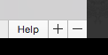

Choose `blank workflow`
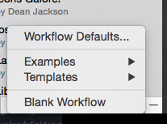


Create a script filter object. Press the `+` sign in the upper-right corner of the pane.


Choose `Inputs -> Script Filter`
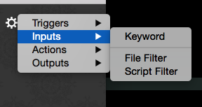

Let's fill out the script filter properties.
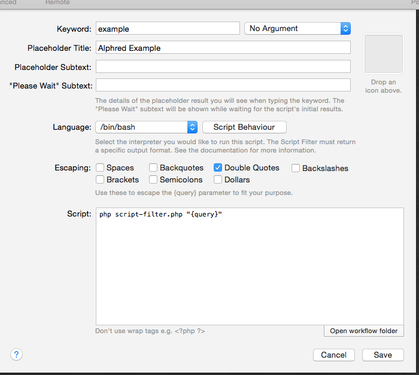

We're going to use the __keyword__ `example` because this is an example workflow. Currently, there is no argument, which is fine. Enter a __Placeholder Title__. Next, we're going to use `/bin/bash` _not_ `/usr/bin/php` because we'll develop the php code in a separate file. It's easier that way. So, we'll enter the simple script:
````shell
php script-filter.php "{query}"
````

That simply runs the file `script-filter.php` with the php command line. `{query}` is a special pseudo-variable that take the input of the script. Right now, we have no argument, so the `{query}` doesn't really matter, but we'll expand that later. Also, note the quotes around `{query}`. Set the escaping to match the image.

Now, `script-filter.php` does not exist yet, so we'll have to make it. Click the `Open workflow folder` button. Click back to Alfred Preferences, and click the `Save` button.

Okay, so the directory opened in Finder contains only one file: `info.plist`. This is the workflow definition file that Alfred creates. Don't touch it. Next, download `Alphred.phar` from Github and drag it into the folder. Last step, for now, create a new file called `script-filter.php` in the directory and open it with your favorite text editor.

> If you use TextEdit, then make sure you switch to "plain text" mode.

Let's start with some code:
````php
<?php
require_once( 'Alphred.phar' );

$workflow = new Alphred;
$workflow->add_result([ 'title' => 'This is a title' ]);
$workflow->to_xml();
?>
````

So, what does that code do? First, we require the Alphred library. Even though it's a `phar`, you use it just like any php file.
> `phar` stands for PHpARchive. `Alphred.phar` is actually over 20 files rolled into one convenient file.

Alphred contains many different components, each in its own class, but the most commonly used ones are simplified in a "wrapper" class called `Alphred`, and that's what we'll be using throughout this tutorial.

`$workflow = new Alphred;` instantiates a new object of the Alphred class. The next line adds a single item to the script filter with a title that is, simply, `This is a title`, and the last line prints the XML for Alfred to read.

So, try it. Call up Alfred and type `example` (our keyword), and you should see something like:
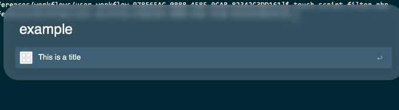

Congrats! We have a working script filter, but it's not very useful yet.

Since we want to grab some information from Github, we have to use their API. [You can go read the documentation](https://developer.github.com/v3/).

Let's change the code in `script-filter.php`:
````php
<?php
require_once( 'Alphred.phar' );
$workflow = new Alphred;

// This is actually my username
$username = 'shawnrice';
// This isn't actually my password
$password = 'thisismypassword';

// Github advises us to explicitly add the header below
$options['headers'] = [ 'Accept: application/vnd.github.v3+json' ];
// Github also demands that we set a user-agent
$options['user_agent'] = 'alfred';
// Github gives us a default of 30 repos in the response, but we can push it to 100. Let's get 100.
$options['params'] = [ 'per_page' => 100 ];
// Lastly, we're using basic authorization with Github rather than any Oauth or Access Tokens, so
// we'll go ahead and add in the basic authorization with the username and password below.
$options['auth'] = [ $username, $password ];
// The request variables have been set, so let's execute it. If we wanted to adjust the caching options,
// then we'd pass another argument.
$repos = $workflow->get( "https://api.github.com/users/{$username}/repos", $options );
// We know that we're getting JSON data, so we'll also decode it into an easily accessible array.
$repos = json_decode( $repos, true );

foreach ( $repos as $repo ) :
	$workflow->add_result(['title' => $repo['name'] ]);
endforeach;
$workflow->to_xml();
?>
````

Use the code above, except put in your username and password in the code. Your output will start to look different than mine -- because we have different repositories, but it should look something like this:
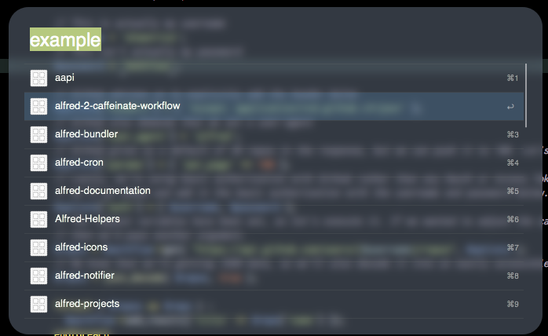

So what happened above? Well, we made a `GET` request to Github, but, first, we had to set some parameters, which go into the `$options` array. Github gives us some `json`, so we decode the `json` into a php array.

> By default, the request is cached so that we don't have to actually reach Github each time. This makes the workflow go faster. I'll show you how to turn this off later.

Next, we cycle through the results (`$repos`) and add a script filter item for each repo, and lastly, print the xml.

Progress. But let's do a bit more with it. Go back to Alfred Preferences, and change the script filter dialog to have an "optional argument":
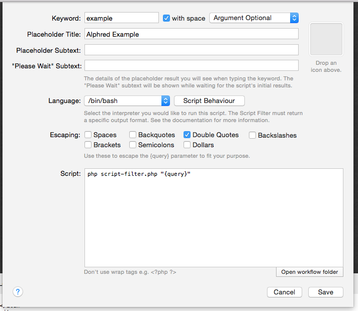

> The optional argument means that the script filter will run with or without an argument.

Now, we have a lot of repositories, and we want to be able to search for a specific one, so let's implement a `filter`. First, we need to capture the `{query}`.

> When you pass arguments to a php script via the command line, they appear in an array called `$argv`.

Near the top, add in the lines:
````php
$query = '';
if ( isset( $argv[1] ) ) {
	$query = $argv[1];
}
````

Since we put quotes around `{query}`, the argument will be contained entirely in `$argv[1]`. If we hadn't, then each space would be a new array item. So "this query" would have `$argv[1]` equal to `this` and `$argv[2]` as `query`. But, if there is no query, then the script will throw an error on the line `$query = $argv[1];` since `$argv[1]` is not set. That's why we initialize `$query` as an empty string and then set it only if `$argv[1]` is actually set.

Next, above the `foreach` loop where we added the results, add in the line:

````php
$repos = $workflow->filter( $repos, $query, 'name' );
````

Here, we're using the `filter` to remove anything that is not related to `$query`. Running the script with the argument `api`, for me, now looks like:
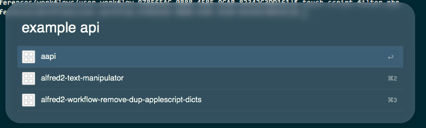

See, fewer items. Nice.

Also, you might notice that if you type in a query that filters everything out, you'll see this:
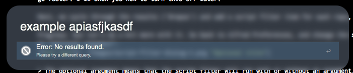

The reason is that, by default, an option is turned on called `error_on_empty`. I think that this behavior is better than just showing the fallback searches, which is exactly what Alfred does when the script outputs no usable XML. If you want to turn this off, then change
````php
$workflow = new Alphred;
````

to
````php
$workflow = new Alphred([ 'error_on_empty' => false ]);
````

Anyway, our script filter now returns some results, but it doesn't do anything, so let's make it do something. First, create a file called `action.php`. We'll worry about the contents in a moment. Also, create a `Run Script` object by clicking the `+` in the upper-right corner, and selecting `Actions -> Run Script`. Again, we'll use a bash script with the same escaping. The contents of the script will simply be:
````shell
php action.php "{query}"
````

Here's what it should look like:
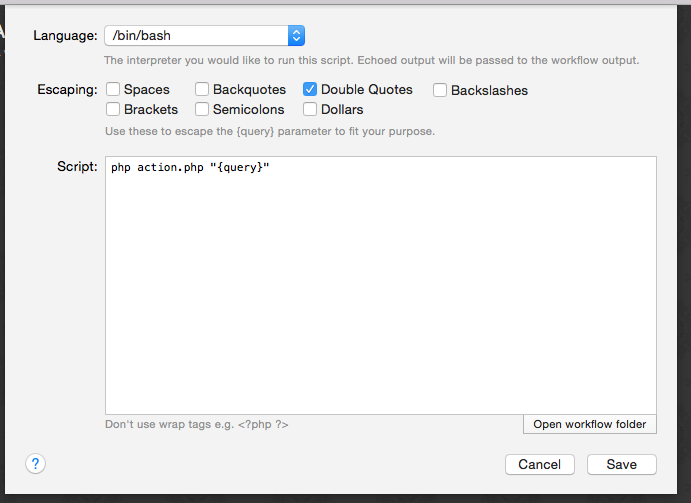

Next, connect the Script Filter to the Run Script by clicking the little tab on the right side of the Script Filter object and dragging it to the Run Script object. Okay?

Let's get back to some code.

Open up `action.php` and paste in the following:
````php
<?php
if ( isset( $argv[1] ) ) {
	exec( "open {$argv[1]}" );
}
?>
````

What does this do? Well, it just takes `$argv[1]` (which is `{query}`), and uses a bash command `open` to open it. We're going to change the script filter to pass the URL of the Github repo, and so this script will open the URL in the default browser. Now, you might be thinking that this is silly: why are we using a php script to run a bash command? The reason is that we're going to build `action.php` into something better.

But, we do have to change `script-filter.php` to pass the argument. So, go back to `script-filter.php` and change the `foreach` loop to:
````php
foreach ( $repos as $repo ) :
	$workflow->add_result([
		'title' => $repo['name'],
		'arg'   => $repo['html_url'],
		'valid' => true
	]);
endforeach;
````

Now, you can press `enter` on one of the results, and it will pass the arg (`$repo['html_url']`) to `action.php` that will open the URL. But we have to set `valid` to `true` in order to let Alfred know that you can action it.

This is great, but what if you want to distribute it? You have your Github username and password hardcoded into the file, and it's not so great to make users edit the php file in order to set their credentials. Alphred offers nice and easy ways to use configuration files as well as to set passwords securely. So, let's revisit the script filter.

Change the lines:
````php
$username = 'shawnrice';
$password = 'thisismypassword';
````

to

````php
// Read the username from the config file
$username = $workflow->config_read( 'username' );

// If the username has not been set, then we'll just show one option for the script filter
// that will lead to the action to set the username.
if ( ! $username ) {
	$workflow->add_result([
			'title'    => 'Please set your username',
			'subtitle' => "Set username to `{$query}`",
			'arg'      => "set-username {$query}",
			'valid'    => true
	]);
	// Print out the XML
	$workflow->to_xml();
	// Exit the script with a status of 0 (which means sucessfully completed -- no errors)
	exit(0);
}

// We're going to try to read the password from the Keychain.
if ( ! $password = $workflow->get_password( 'github.com' ) ) {
	// The password has not been set, so we'll provide only one option to set the password
	$workflow->add_result([
			'title' => 'Press enter to set your password',
			'arg'   => 'set-password',
			'valid' => true
	]);
	// Print out the XML
	$workflow->to_xml();
	// Exit the script with a status of 0 (which means sucessfully completed -- no errors)
	exit(0);
}
````

So what did we just do? Well, `$workflow->config_read( 'username' );` tries to read the key `username` from the config file. We don't have one yet, but we don't have to worry about creating one; Alphred will do it for you when you try to write to it the first time. But, if there is no value yet, then we'll just add an item to the script filter that tells the user to set their username, and uses the query to do so. Then, we print out the XML (`$workflow->to_xml()`) and use `exit(0);` to end the script so that it doesn't keep running.

If the username is not set, then we it should look something like:
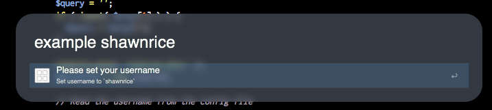

Almost the same thing goes for the password, except we're using the `get_password` method, which integrates with the System Keychain. Yes, that means that the password is encrypted securely. We can access it from the workflow -- once it's set -- but, otherwise, anyone needs to enter the user's system password to see it.

When the password is not set, it will look like:
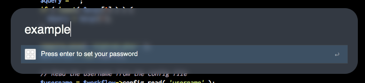

But, the script filter doesn't set anything on its own, so we need to edit `action.php` in order to do something. So, rewrite it so that it looks like:
````php
<?php
require_once( __DIR__ . '/Alphred.phar' );;
$workflow = new Alphred;

$action = trim( $argv[1] );

if ( 0 === strpos( $action, 'set-username ' ) ) {
	$username = trim( str_replace( 'set-username', '', $action ) );
	if ( empty( $username ) ) {
		die( "Empty username" );
	}
	$workflow->config_set( 'username', $username );
	print "Set username to {$username}\n";
	exit(0);
}

if ( 'set-password' == $action ) {
	$password = $workflow->get_password_dialog();
	if ( empty( $password ) || 'canceled' == $password ) {
		die( "Empty argument" );
	}
	if ( $workflow->save_password( 'github.com', $password ) ) {
		$workflow->console( 'Set password for github.', 1 );
	}
}


if ( filter_var( $action, FILTER_VALIDATE_URL ) ) {
	exec( "open {$action}" );
}
?>
````

So, that's a lot of new code. Let's go through it.

We now need the Alphred library because we're going to be using some of the methods. We create the Alphred object as `$workflow` just as in `script-filter.php`, and we capture the `{query}` variable (`$argv[1]`) as a variable called `$action`. Also, we `trim` the variable to remove leading and trailing whitespace.

This script now has three different actions:
1. Set a password,
2. Set a username, and
3. Open a URL.

Each of those correspond to one of the `if` statements above. First, we look to see if the `$action` is `set-username`; next, we check for `set-password`; and, lastly, we check to see if it's a URL. Let's handle them one at a time.

We're passing the username with the `set-username` action. It's nice an simple that way, so first we check to see if the string `set-username` is in `$action` with
````php
if ( 0 === strpos( $action, 'set-username ' ) ) {
````

> It's good practice to use Yoda syntax here for matching becaue it's easier to debug. It's good to do with all your if statements, if possible.

Note the triple `=`. Normally, we'd use double, but since `set-username` has a position of `0`, and since `0` evaluates to `false`,
````php
if ( 0 == strpos( $action, 'set-username ' ) ) {
````

will evaluate to `false` if the action is `set-username shawnrice`, which is not what we want. Thus, we use exactly equals `0` (`===`).

When it evalutes to true, we grab the username by cutting out `set-username` and trimming the whitespace.
````php
	$username = trim( str_replace( 'set-username', '', $action ) );
````

But, we add in a quick check to make sure that the username isn't empty (just whitespace). If it is, then the script will exit with an error because of `die`.

Now, the remaining lines:
````php
	$workflow->config_set( 'username', $username );
	print "Set username to {$username}\n";
	exit(0);
````

the first sets the `username` key in the config file to the value of `$username`. Sweet. What does it actually do? It creates a file called `config.ini` in your workflow's data folder.
> Workflows should store their "persistent" data (data that sticks around) in the data directory, which is located at `~/Library/Application Support/Alfred 2/Workflow Data/{WORKFLOW_BUNDLE_ID}`.

You don't have to worry about the path or creating the directory or the file: Alphred does it for you. And, by default, it creates an `ini` file.

Why `ini`? Well, it's easy for users to edit if they need without messing it up. You can change the format of the config file to `json` or `sqlite3` as well as the filename, but we aren't going to cover that here.

So, `$workflow->config_set( 'username', $username );` sets the username, then we print a message, and exit the script so that it doesn't keep running.

To set the password, we're going to use the `save_password` method that employs the system keychain. But, if you remember, we didn't pass a password with the script filter (like we did with the username). Why not? Well, it's a password, and we'll treat it as one with a hidden input textbox, just like webforms do that way, if someone is looking over your shoulder, they don't see you type in your password. Alphred makes it really easy to do this with the method: `get_password_dialog`. It creates a simple AppleScript dialog with a hidden input field. You can set the title, the text, and the icon by passing arguments, but, by default, the title is the name of the workflow, the text is
````
Please enter the password.
````

And it looks like:
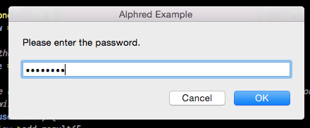

Now, in the `if` statement, we have the lines:
````php
	if ( empty( $password ) || 'canceled' == $password ) {
		die( "Empty argument" );
	}
````

Why? Well, we want to make sure that the password isn't empty because Github does not allow that. The dialog will return `canceled` if the user presses the `cancel` button, so we consider that an error, also because no one should ever set their password to `canceled`. So, if either of those are true, we don't save the password but instead `die` with an error message.

If we make it past the `if` statement, then we set the password in the system keychain and log a message to the console:
````php
	if ( $workflow->save_password( 'github.com', $password ) ) {
		$workflow->console( 'Set password for github.', 1 );
	}
````

The `if` statement here just checks to make sure that setting the password was a success. The `console` method is nice because it will write things out to the Alfred Debugger, making it easy to send information to the user and to help you debug. __But__, this message will never show up. Why not? Well, the second argument for `console` is the `log_level`. Alphred defines five levels of log messages:
1. DEBUG
2. INFO
3. WARNING
4. ERROR
5. CRITICAL

You also can set your log "threshold," which means that anything under the "threshold" will not appear. By default, the log level is set to `WARNING`; since this message that we just logged is `INFO` (`1`), it will not appear. You can change the log level either in a `workflow.ini` file or by defining the constant __before__ you include Alphred.phar.

> i.e. `define( 'ALPHRED_LOG_LEVEL', 'DEBUG' );`

That's it. Now the password is saved. If you entered the correct password, then when you invoke the workflow again, you'll see your repos again.

The last `if` block opens the URL, which is the first action that we set. But we changed it a bit. The statement
````php
if ( filter_var( $action, FILTER_VALIDATE_URL ) ) {
````

makes sure that the string is a valid URL. That doesn't mean that the URL exists but that it is just a well-formed URL. This `if` statement adds in a little bit of error checking.

Now, if you wanted, you could distribute this workflow. But we're missing a few things. There are no icons (the workflow is ugly!), we have so much more information that we can add in, and the user cannot change their username or password once it's been set.

Let's get some icons. [Font Awesome](https://fortawesome.github.io/Font-Awesome/) has a nice Github one. But we wat to get it in some nice colors. Dean Jackson created a nice little utility that helps with these, and you can find my mirror at [this link](http://icons.shawnrice.org/preview/fontawesome). Change the colors with the color-picker in the upper-left hand corner of the page, and click on the icon to create it. Then download it. We'll get one in `#444444` and another in `#eaeaea`. We'll call them `github-dark.png` and `github-light.png` and place them in the root of the workflow directory.

Here they are:
 

Why a light version and a dark version of the icons? Well, sometimes people have dark themes and others have light themes. Using a light icon on a light theme makes it not show up. Alphred gives you a nice little method to find out whether or not the background is light or dark.
````php
$background = $workflow->theme_background();
````

It will return `light` if the background is `light` and `dark` if the background is dark.

So, go back to `script-filter.php` and change the `foreach` loop:
````php
if ( 'light' == $workflow->theme_background() ) {
	$icon = 'github-dark.png';
} else {
	$icon = 'github-light.png';
}
foreach ( $repos as $repo ) :
	$workflow->add_result([
		'title'    	=> $repo['name'],
		'subtitle' => $repo['description'],
		'uid'      	=> $repo['name'],
		'arg'       => $repo['html_url'],
		'valid'     => true,
		'icon'     	=> $icon
	]);
endforeach;
````

If you notice, we also added in a subtitle that displays the description of the repository. And we set the `uid` to the name of the repository.

But, we have icons, and they respond to the theme:
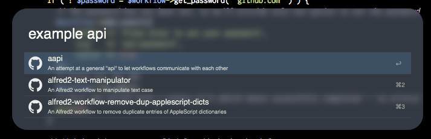

Or, if I change my theme:
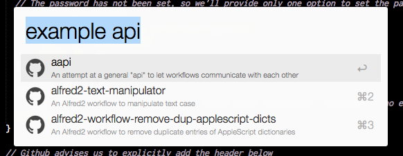

But, let's go back to the `uid`. The results that are filtered through Alphred's `filter` method sorts them based on the match score. Alfred can override these, and it does so if you set a `uid`. The way that it works is that the more the you action an item with a `uid`, the higher it appears in the result list.

Now, we need to add some items back into the script filter so that the user can reset their username and password if they desire. It's pretty easy, just after the `foreach` loop, add the following:
```php
$workflow->add_result([
		'title'    => 'Set Your Github Username',
		'subtitle' => "Set username to `{$query}`",
		'arg'      => "set-username {$query}",
		'icon'     => $icon,
		'valid'    => true
]);
$workflow->add_result([
		'title' => 'Set Your Github Password',
		'arg'   => 'set-password',
		'icon'  => $icon,
		'valid' => true
]);
````

Let's just change one last thing. Instead of having the description of the repository (they're yours, you probably remember them), let's change the subtitle to the last updated time.

So, change the `foreach` to:
````php
foreach ( $repos as $repo ) :
	$workflow->add_result([
		'title'    	=> $repo['name'],
		'subtitle' => $workflow->fuzzy_time_diff( strtotime( $repo['updated_at'] ) ),
		'uid'      	=> $repo['name'],
		'arg'       => $repo['html_url'],
		'valid'     => true,
		'icon'     	=> $icon
	]);
endforeach;
````

The method `fuzzy_time_diff` converts a time (a Unix Epoch Time) to a fuzzy string like `yesterday` or `almost a month ago`. So, look at it now:
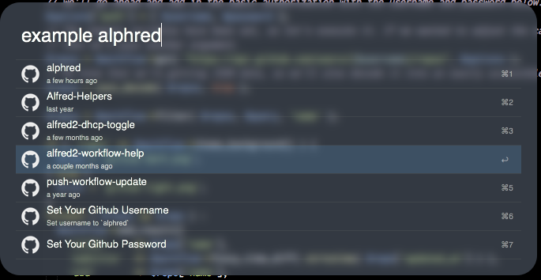

We're going to change one more aspect about the workflow. Currently, the results are a bit too wide. We can change the matching rules for the `filter` method. So, change the `filter` line to
````php
$repos = $workflow->filter( $repos, $query, 'name', [ 'match_type' => MATCH_STARTSWITH && MATCH_ATOM && MATCH_SUBSTRING ] );
````

The capitalized flags `MATCH_*` are constants set by Alphred and determine different matching patterns. You can read more about them on the filters page.

Let's also give the workflow an icon. Just copy `github-dark.png` to `icon.png`, and that will serve as the icon for the workflow so that it looks like:
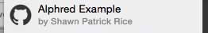

Lastly, `action.php` prints out some information when setting the `username` and `password`. We can use these to display notifications by adding on a Post Notification object.

Create one by pressing the `+` in the upper right corner of Alfred Preferences window and select `Outputs -> Post Notification`.

Set it up so that it looks like:
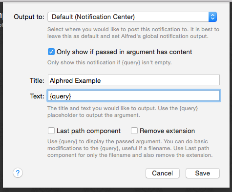

And then connect it so that the workflow looks like:
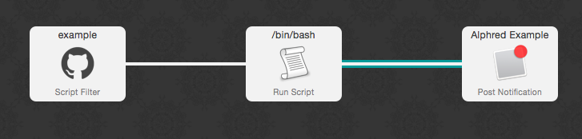

We'll change just one more thing about `action.php` so that a notification will be sent:
````php
if ( $workflow->save_password( 'github.com', $password ) ) {
	$workflow->console( 'Set password for Github.', 1 );
	print "Password has been set for Github\n";
}
````
The `print` statement just lets us know that the password has been set, but it doesn't show it.

That's it. You have a fully functional workflow, using Alphred. But there are many different parts of Alphred that we haven't even touched. Find out more about them. By reading some of the other markdown files in this directory or reading through the API documentation.